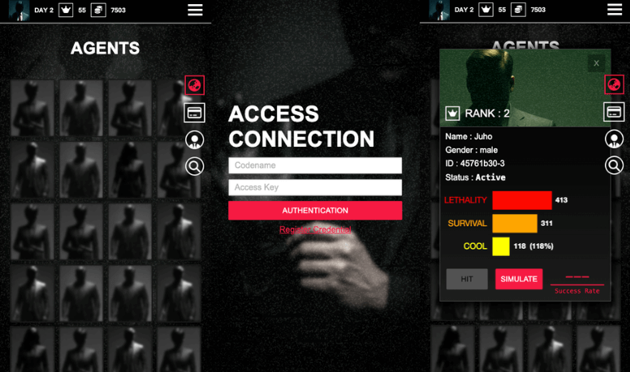

# HIT


### Hunt • Infiltrate • Terminate

**HIT** is a dark, stylish browser-based strategy game inspired by _Hitman_ and _John Wick_.  
You play as an elite assassin in a deadly world of rivals. Eliminate enemies, earn gold, and climb the ranks — or die trying.

## Live Demo

[https://klu0926.github.io/hit/](https://klu0926.github.io/hit/#/create)

## Table of Contents

- [Overview](#overview)
- [Setup Instructions](#setup-instructions)
- [Features](#features)
- [Game Rules](#game-rules)
- [Challenges Faced](#challenges-faced)
- [Libraries Used](#libraries-used)
- [APIs Used](#apis-used)
- [Credits](#credits)

## Overview

In HIT, players:

- Log in as an undercover agent
- View a list of enemy assassins
- Choose targets and launch attacks
- Upgrade gear and stats in the black market
- Try to survive as long as possible while enemies grow stronger

## Setup Instructions

1. Clone this repository:

   ```bash
   git clone https://github.com/your-username/hit.git
   cd hit
   ```

2. Open the project using a live server  
   (for example, the Live Server extension in VS Code)

3. Play the game in your browser

## Features

### Authentication

Uses the Reqres.in API to simulate login.  
Each player is saved locally with a token in `localStorage`.  
Supports multiple saved accounts.

  


### Randomly Generated Enemy Targets

Enemies are created using Random User Generator and AI-generated avatars.  
Each target is unique and randomized.


### Target Stats & Profile

Enemies come from three archetypes with different stats and growth patterns.  
Stats include Lethality, Survival, and Cool, shown using Chart.js.  
You see their real identity and photo only after defeating them.


### Combat System

Combat is automatic and based on Lethality stats.

- Win: Earn gold and move up in rank
- Lose + Survive: You live, but gain nothing
- Lose + Die: Your profile is permanently deleted


### Shop

Spend gold to buy weapons, armor, and gear.  
Boost your stats and improve survival.


### Day Progression & Scaling

Each fight advances one in-game day.  
Enemies grow stronger, and the shop restocks with new gear.

### Permadeath

If you die in combat, your profile is erased.  
There’s no restart — just legacy.

### Responsive Design

HIT works on smaller screen sizes too. It runs on **phones**, **tablets**, and **small devices**, not just desktops.



## Game Rules

**Perform a HIT**  
Go to the Agents tab, pick a target, confirm the strike, and walk away.

**Combat Outcomes**

- Win – Eliminate the target. Gain gold. Take their rank. +1 Day.
- Lose + Survive – No gain. +1 Day.
- Lose + Die – Game over. Your profile is deleted.

**Stats**

- **Lethality** – Chance to kill
- **Survival** – Chance to survive if you lose
- **Cool** – Gold earned per HIT

**Shop**

Use gold to buy upgrades and boost your chances.

**Days**

Each battle moves time forward. The world becomes more dangerous.

## Challenges Faced

### Combat Balancing

Many test runs were needed to make fights feel fair but intense.  
Enemy stats grow daily, and chance adds unpredictability.

### State Persistence

No backend is used.  
All player data (gear, stats, rank, day count) is saved in `localStorage`.

### Single Page Application (SPA)

This was my first time building a SPA without a framework.  
I had to handle screen changes, save game state, and trigger custom events when data changed.

### Hash Routing

I built a `setRoute()` function to manage page changes using hash URLs.  
Making it work smoothly with GitHub Pages took extra tweaking.

### Chart.js

Chart.js setup was confusing at first.  
I used trial and error to make the charts update correctly with each game change.

## Libraries Used

- **Font Awesome** – Icons
- **Google Fonts** – Typography
- **Chart.js** – Stat visualizations
- **bcrypt** – Password hashing

## APIs Used

- **[RandomUser](https://randomuser.me/)** – For generating enemy agents
- **[Reqres.in](https://reqres.in/)** – For mock login and authentication

## Credits

**Background Music**

- Music: Bensound
- Artist: Theatre Of Delays
- License Code: 4QWQNLT5VPH4OT3L

All rights belong to their original creators.  
This project is for educational and non-commercial use only.
